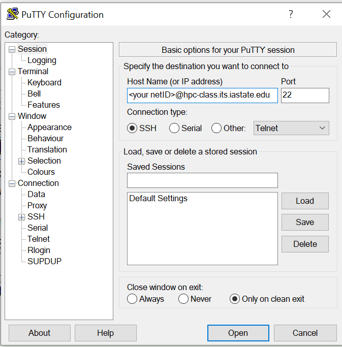
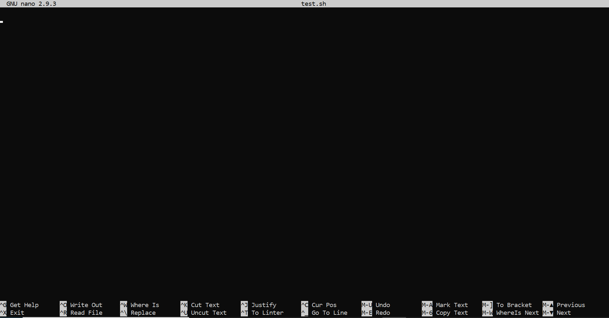

# Unix Tutorial
## Rob Schmidt
## August 16, 2021

This is an introduction to the Unix envrironment given on August 16, 2021 as part of the BCB GSOs programming workshop series.

This work is heavily based off my previous Unix tutorial found [here](https://github.com/robertschmidt54/AdvancedUnixTutorial). 


# Before Starting:
## If you are off campus:
You will need to turn on the VPN to access Iowa State's clusters. Instructions to install and configure the VPN can be found [here](https://iastate.service-now.com/it?id=kb_article&sysparm_article=KB0011105&sys_kb_id=f7ea47ca1b75341032aa99fe034bcb6c) if you haven't already installed it. Make sure to do this before following any of the next steps.

* Even if you plan to attend in person it is a good idea to install the VPN, that way you will be ready to work on the clusters from anywhere there's an internet connection. You will not have to turn it on when you're on the campus network though.

## If you are on Mac or Linux:
Open terminal and type the following commands. 
You can copy using ```command C``` and right click to paste the command into the terminal, or just type it.
```
ssh <netID>@hpc-class.its.iastate.edu
```
When prompted enter you ISU netID (the first part of your ISU email address) and password. 
* Note the terminal will **NOT** display anything as you type your password. Don't worry it is being typed.

Then enter the following:
```
git clone https://github.com/robertschmidt54/UnixTutorial_BCBWorkshop/
cd UnixTutorial_BCBWorkshop
```
And you are ready to begin 🥳.

## If you are on Windows
### Connect using PuTTY
You should have installed PuTTY before coming to this workshop. If you have not it can be downloaded and installed [here](https://www.chiark.greenend.org.uk/~sgtatham/putty/latest.html). Go ahead and open it now. You'll see a window that looks like this:




Enter your netID in place of '\<your netID\>' and hit open. When prompted enter your password, and you should be good to go.

Once you are connected type the following into the PuTTY window:

```
git clone https://github.com/robertschmidt54/UnixTutorial_BCBWorkshop/
cd UnixTutorial_BCBWorkshop
```

and you are now ready to start 🥳.

### If you are on Windows 8.1 or above you can use Powershell
Powershell is Windows answer to the terminal in MacOS. It allows you to run many of the commands you learn today naitively on Windows without the need to install anything or faf about with settings! It comes installed by default on all modern instances of Windows, and the ssh functionality is even on by default.

You can find powershell by searching for it in your programs. Once you've got it running run the following:

```
ssh <netID>@hpc-class.its.iastate.edu
```

where /<netID/> is replaced by your actual net ID.
* Note the terminal will **NOT** display anything as you type your password. Don't worry it is being typed.

Once you are connected (it may ask for authentication, just type 'y' or 'yes') you can enter the following:

```
git clone https://github.com/robertschmidt54/UnixTutorial_BCBWorkshop/
cd UnixTutorial_BCBWorkshop
```

You are now ready to start 🥳.
 
# Let's get started: Why do we even want to learn about Unix?
Linux/Unix has become the standard operating system for high performance computing clusters (HPCs) all around the globe. If you want the power of an HPC you need to learn the fundamentals of Unix. Plus almost all of the most popular bioinformatics tools are used on the command line. Trust me it may look intimidating at first, but I hope you will find it is not as hard as you thought.


*No GUI No Problem :sunglasses:*

# Some Basics:

Let's start by looking at the anatomy of a command all commands will have this form:

```command_name [options] [arguments]```

* **Arguments** are things we want our command to act on. Usually file names or folders.
* **Options** will change the behavior of the program. They are specified by a dash ```-``` followed by a single character or two dashes ```--``` followed by a word.
* * for example: ```ls -l -h myFolder``` has two options specified (the -l and -h) and one argument (myFolder). 

**Protip:** you can sometimes combine options to save on typing: the command ```ls -lh myFolder``` is the same as the one above. You can only do this if you specify an option using the single dash ```-``` however.

Always remember in Unix spaceing and capitalization matter. ```echo``` is not the same as ```Echo``` for example. Unix uses spaces to seperate arguments and options.

## Essiential commands:
Now that we know what makes a command lets start with some essientials:

### Figure out what a command does with ```man```
* I put this one first because ```man``` can be used to remind ourselves what each of the following commands do, and the options aviable.
* To use it just type:
* * ```man <command_name>```
* And you will be taken to a manual page for the command.

### Print Things to The Screen using ```echo```
* ```echo``` will print something to the screen.
* Let's run our first command:
* * ```echo Hello World!```

This will just print the phrase "Hello World!" to the screen. Easy right?


### List files with ```ls```
* ```ls``` short for list lists files in the current directory. I love it when names make sense.
* ```ls``` does not need an argument, it defaults to the current directory, but you can always provide one and it will list all files in the folder you provide.
* To get a list of options for this or any command remember we can use the command ```man```.
*   So to get the manual for ```ls``` we type:
``` man ls```
and hit enter.

### Find out where you are with ```pwd```
* ```pwd``` is short for "Print Working Directory" it will print the current working directory to the screen. 
* it can be run without an argument.

### Change directories with ```cd```
* ```cd``` will change the directory you are currently working in. 
* unlike the other two commands we've learned ```cd``` needs an argument: the directory you want to change to.
* let's change to the ```data``` directory: ```cd data```
* Now we want to go back to our previous directory to do this we use ```cd ..```
* The ```..``` means 'go up one level'
* There is also ```.``` which is short for the current directory. So ```cd .``` will not do anything.
* There is a short hand for your home directory too: ```~```
* * ```cd ~``` will take you back to you home folder no mater where you are.

#### A note on paths and directory trees:
In Unix documentation you will often see reference to "paths" to a file. What this is asking for is the list of folders you need to go through to get to that file. Unix file paths are formated like this:

```/home/folder/folder2/another_folder/yet_another_folder/bob/the_file_you_want.extension```

There are two important parts of the directory to note:
* The Root denoated by that starting slash ```/``` is the top most directory in your computer. Important files are stored here, and you should probably avoid doing things here if you don't know what you are doing. 
* Your ```home``` directory. It may or may not be called 'home', often it will be your user name. It is the top most folder that is techincally yours. It is also the directory you start in when you connectted to hpc-class.


## Commands to Mess with Files:

### Make new folders with ```mkdir```
* ```mkdir``` will make a new folder in the current directory.
* * Example: ```mkdir testDir```. Now if you use ```ls``` you should see a new directory called testDir. You can feel free to change to that directory now.


### Make new files with ```touch```
* ```touch File.txt``` will create a new empty file called 'File.txt'. 
* Note that this file will be empty you can use ```ls -lh``` to verify it is in fact empty. You can use ```man ls``` if you are unsure what the l and h mean.
* You can specify a path if you want to make a file in a different directory:
* * ```touch folder/File.txt```
* ```touch``` will just make empty files, we will get to making files with stuff in them a little later.

### Delete files with ```rm```
* ```rm``` short for remove, allows us to delete files. 
* Note that the process is irreversable. Once deleted files can not be recovered.
* **Always make sure you know what you are deleting.**
* ```rm``` just removes files, we need to specify the option ```-r``` to remove directories. If you don't believe me check ```man rm```, or just try removing a directory with ```rm```
* Example:
```
mkdir testDir
ls
cd testDir
ls
touch MyFile.txt
ls -lh
rm MyFile.txt
ls
cd ..
rm -r testDir
ls
```
We have just combined many of the commands we've seen to do something entirely pointless: create a directory called 'testDir' list the current files and folders to confirm testDir was made, change to testDir, list the empty contents of testDir, make an empty file call MyFile.txt, list the contents again to ensure the touch command went through, then removed that file, confirmed the deletion, change directories back to our previous directory, and delete testDir. 

Trust me we will get to some more interesting stuff later.

### move, rename, and copy files with ```mv``` and ```cp```
* ```mv``` and ```cp``` both move files.
* ```mv``` will delete the original file, while ```cp``` will keep it.
Let's see an example:
```
mkdir testDir #Yes we are doing this again.
cd testDir
mkdir subDir
touch TestFile.txt
ls
cp TestFile.txt subDir/
ls
ls subDir/
rm subDir/TestFile.txt
ls subDir/
mv TestFile.txt subDir/TestFile.txt
ls
ls subDir/
mv subDir/TestFile.txt
mv TestFile.txt RenamedFile.txt
````

* ```mv``` can be used to rename a file.

### Look at file contents using ```cat```, ```head```, ```tail```,  ```less```, and ```more```
* ```cat filename``` will print the contents of the file to the screen. If you aren't already change to the data directory and try:
```cat SRR_Acc_List.txt``` 
**Protip:** you can use the tab key to auto complete filenames, and directories. This will help to speed up coding.
The output will look like:
```
SRR13275198
SRR13275209
SRR13275216
SRR13275217
SRR13275250
SRR13275249
SRR13275238
```

* ```head``` and ```tail``` are used to look at the first few lines or last few lines of a file. 
* The ```-n``` option can be used to customize the number of lines displayed. The default is 10. 

You will notice it may take a bit to print the entire contents of some larger files to the screen.
* That's where ```less``` and ```more``` come in. They are built in file navigators allowing us to look through larger files that don't fit well on a single screen.
* Lets look at one of the fastq files in the ```RawSequenceData``` directory
``` less RawSequenceData/SRR13275198.fastq```

This opens up the fastq file which looks like: 
```
@SRR13275198.1 1 length=58
AGTCAAGCCTCACGAGCAATTAGTATTGGTCAGCTTCACATATCACTATGCTTCCACA
+SRR13275198.1 1 length=58
6AEEEEEEEEEEEEEEEEEEEEEEEEEEEEEEEEEEEEEEEEEEEEEEEEEEEEEEEE
@SRR13275198.2 2 length=58
ATGCATACCCACGCCATGAATGGTCACTTCACCATTTTTAGGGCCTTCAATGCTTACA
+SRR13275198.2 2 length=58
/A<EEEEEEEEEAEEEEEEEEEEEEEEEEEEEEEEEEEEEEEEEEEEEEEEEEEEEEA
@SRR13275198.3 3 length=58
AAACAGTACCCTGTTTGCCTTTTTCTTTACCTGCGATCACGATAACCTGATCGCCTTT
+SRR13275198.3 3 length=58
/<6EEEEEEEEEEEEEEEEEEEEEEEEEEEEEEEEEEEEEEEEEEAEEEEEEEEEEEE
@SRR13275198.4 4 length=58
GAGCCTAAATATCCAGACAATATTCCAGAACCAGATGAAATAGAGGTCGAAGACCTAA
+SRR13275198.4 4 length=58
<AAEEEEEEEEEEEEEEAEEEEEEEEEEEEEEEEEEEE/EEEEAEEEEEAEE/AEEEE
@SRR13275198.5 5 length=58
TCGGTTTCGGGTACGATTCCTGTGTAACTGAAGCTTAGAGACTTTTCCTGGAAGCATG
+SRR13275198.5 5 length=58
<EEEEEEEEEEEEEEEEEEEEEEEEEEEEEEEEEEEEEEEEEEEEEEEEEEEEEEAEE
@SRR13275198.6 6 length=58
ATTTGTAAAGCGGCAGAACTTGCGACGACGGTAAAAACGTGCCATTGATGTTCTCCTT
+SRR13275198.6 6 length=58
<<</EEEAEEEEEEEEEEEEAEEEAEEEEEEEEEEEEEEEEEEEEEEEEEEEEEEEEE
@SRR13275198.7 7 length=58
GTGCACTAGCAACGCTGTCAATTGCAGAAATTTGTGGCATACCGATACCAGCCACAAT
+SRR13275198.7 7 length=58
6/EEEEEEEEEEAAEEEEEEEE/EEEEEEEEEEAEEEEEEEEEEEEEEEEEEEEEEEE
@SRR13275198.8 8 length=58
```

You can move around using the up and down arrow keys. You can search for words using /, ```Shift + g``` will get you to the end of the file, and '''g''' will  bring you to the beginning of the file. 

```more``` is just another file navigator similar to ```less``` but with less functionality. We won't cover it here, but feel free to experiment on your own!

## Redirect ```>``` and append ```>>```
* We've seen how to make empty files up until now, but what if I want to actually put text inside that file? 
* Redirect ```>``` can be used to redirect the output of any unix command to a file. The syntax is:
```command > file.extension```
* For example let's redirect the output of ```echo``` to a file:
```
touch myFile.txt
echo "Hello World!" > myFile.txt
```
* Redirect will overwrite any existing data in the file. Yes, you can use it to overwrite an existing file. Just be careful with it.
* Append ```>>``` on the other hand will append to a file.
* It has the same syntax as redirect.
* Ex:
```
echo "Stuff" >> myFile.txt
```

## Pipe ```|``` and ```grep```
* Pipe ```|``` (```shift + \``` the key just above the enter key on most keyboards.) let's you take the output of one command and use it as the input to another.
* ```grep``` lets you search walls of text for key words (and more, but let's focus on keyword search for now). 
* * ```grep``` matches line by line and returns matching lines. 
* Example using both pipe and grep:
```
cat data/list.txt | grep spam
```
* We have just printed the contents of list.txt (```cat```), and then searched the output for the keyword "spam", and found it.
* Pipe is very useful for quickly running small pipelines. 

There are many more useful unix commands that we don't have time to cover. I have included in this tutorial a cheat sheet of many of the most useful unix commands.
You will not be able to access the cheat sheet on the cluster.

## Ok, now on to the Advanced Stuff

But first a little review:
Command | Description
--------|-------------
ls \<directory\> | Lists all files in the current directory. If used without an argument lists files in current directory.
cd \<directory\> | Changes to a directory.
rm \<file\> | Permanently deletes a file.
rm -r \<directory\> | Permanently deletes a directory. **Be very careful with rm. Always be absolutely sure you know what you are deleting.**
cat \<file\> | Prints contents of file to screen.
less \<file\> | Opens file for viewing in the less interface.
more \<file\> | Opens file for viewing in the more interface.
head -n \<file\> | print top n lines of a file.
tail -n \<file\> | print last n lines of a file.
cp \<file\> \<new location\> | copies file to new location. Keeps old file.
mv \<file\> \<new location\> | moves file to new location. Deletes old file. Also can be used to rename files.
pwd | prints out current working directory.
mkdir \<directory\> | make new directory.
touch \<file\> | make a new file.

Commands can take multiple flags/options as well as arguments take the rm command. Options always follow 1 or 2 "-" characters in the command.

ex:

```ls -lh``` lists all files in directory and their sizes.

```head -n 5 \<file\>``` prints first 5 lines of a file.

You can always see a list of options for a given command by entering:

```
man <command>
```
or

```
<command> -h
```
Where you can replace \<command\> with any command you know. Not all commands will work with the -h option, but most basic unix commands will work with man. 

The man (short for manual) command will bring up the documentation (also called the man page) for the command. Very useful if you ever forget what a commmand is supposed to do or the options to that command.

I should remind you: **rm -r can be a very dangerous command** Always be sure you are using it properly. **NEVER USE THE COMMAND: rm -rf /** you will literally delete everything on your hard drive.


# Introduction to Programming with Unix
We have learned how to run commands in Unix one at a time via the commandline. However, most of the time we would like to run multiple commands in sequence. 

We've just learned about the Pipe ```|``` operator that allows us to chain commands together. This is useful, but will quickly becomes cumbersome when you have more than a handfull of commands you need to run on multiple files. Enter bash scripting!

Programming in bash is just like programming in other languages. So the skills you pick up here can easily transfer to other languages as well.

In order to write our programs, I will need to introduce a new command ```nano``` nano is one of Unix's built in text editors ([other](https://www.vim.org/) [text editors](https://www.gnu.org/software/emacs/) [are available](https://xkcd.com/378/)).

To open a file with nano:
```
nano helloWorld.sh
```
Your screen will shift to something like this:

You can type anything you want just like you can in Notepad or TextEdit. 
Go ahead and type the following:

```{bash}
#!bin/bash

#This is a comment!
#This is also a comment.
echo "Hello World!"

#Another comment.
```
Once you've typed that hit ```CTRL + X``` you will then be prompted to save your work. Type ```Y``` to save then hit ```Enter``` and you should be brought back to your normal bash shell.

Let's run our program:

```
bash helloWorld.sh
```

Which should print:

```
Hello World!
```

Congratulations you've just written your first program!

Let's take some time to break down what we just did. The first line: ```#!bin/bash``` is required at the beginning of every bash script. It tells the computer what program to use to interpret our instructions. 

You have already seen the ```echo``` command. 

You may have noticed the lines that begin with ```#``` didn't print or mess anything up. This is because they are what are known as comments. Comments are ignored by computers, and are for us humans to know what the code is doing.

Comments are important, please comment your code.

Let's try something a little more complicated open up your helloWorld.sh script and add the following to the end:

```{bash}
#Set x to be the answer to life the universe and everything.
x=42


echo "The answer to life the universe and everything is: $x"
```
Go ahead and save that then run it the output will now be:

```
Hello World!

The answer to life the universe and everything is: 42
```

Here we see an example of declaring a variable. Variables can store values to be used later. They can be numeric or strings. In this case we define a variable ```x``` to be the number ```42```. We then print the variable to the screen using the echo command. Notice how we have to call the variable as ```$x```. This is true of every variable in bash scripting. You need that $. 

### Let's practice:
Let's give you some practice using variables.

1. Open a new script called ```Exercise1.sh```  (using `nano`)
2. Assign the names "Jess", "Jack", and "Jenn" to the variables a, b, c
3. Add a line that uses these variables to print out the sentence:
   "Jess, Jack, and Jenn say hi!"
   
### Parameter and command expansion
A useful feature of bash is parameter expansion. 
say we have a variable storing the word 'cat'

```
x='cat'
```
We want to print the word cats without making another variable. 

We could try:
```
echo $xs #This will not work
```

But this won't work, because Unix thinks we want to print a variable called 'xs'.

To solve this we can use parameter expansion which has the following syntax:

```
echo ${x}s
```

Which will print what we want. 

Command substitution is another tool it can let us evaluate commands inside of other commands. For example:

```
head $(ls *.sh)
```

It can also let us set the output of some commands as variables. For instance:

```
Files=$(ls *.txt)
```

Will give us a variable that is a space separated list of all text files in the current directory. 

### More Practice:
 1) Use parameter expansion and the variables from Exercise 1 (you can add to the exercise 1 file or rewrite them in a new file) to print the
    sentence:
    "Many Jesses, Jacks, and Jenns say bye!
    
 2) The command `whoami` prints your username.
    The command `date` prints the current time.
    Use command substitution to print the sentence:
    "I am \<username\> and today is \<date\>"
    Replacing \<username\> and \<date\> with output of `whoami` and `date`

### Taking arguments from the command line.

Let's make a script to take an argument from the command line. Let's open a new file:

```
nano myEcho.sh
```

We will add the following to it:

```
#!/bin/bash

echo $1
```
Go on and save it. Then type:

```
bash myecho.sh "I want to print this string"
```
Congratulations you've just rewritten the echo command!

As useless as this is it does illustrate a key feature of bash scripting: we can take in arguments from the command line and do things with them.

Arguments coming in from the command line are stored in a hidden list we can access with the variables $0, $1, $2, $3, etc. 

For example:

```
#!/bin/bash

echo $1

echo $2

echo $3 $5

echo $4
```

will print when run:

```
bash myecho.sh "I want to print this string" "And this one" "This one too" "See how this works" "PI"

I want to print this string
And this one
This one too PI
See how this works
```
This is very useful if we want to run a tool on multiple files and we want to keep the same parameters. Here is an example using the aligner ```bowtie2```:

```
#!/bin/bash

bowtie2 --sensitive -p 32 -x Index/AB -1 $1 -2 $2 -S $3
```

If I wrote it to a file called bowtieScript.sh I would run it like this:

```
bash bowtieScript.sh ForwardReads.fastq ReverseReads.fastq Alignment.sam
```
### Practice:
1) Write a line to print arguments 0, 1 and 2

## Running through a list: The for loop:
There are many times when we want to repeat a set of instructions over many elements in a list. Maybe we want to manipulate all the files in a directory, maybe we want to align a list of genes to a reference sequence, or maybe we just want to print out the numbers 1 to 10 in order. All of these can be accomplished using a `for` loop. The `for` loop is outlined in this flowchart:

I think it is best illustrated with an example:

```
for i in 1 2 3 4 5 6 7 8 9 10
do
       echo $i
done
```

which will produce:

```
1
2
3
4
5
6
7
8
9
10
```
We just printed the numbers 1 to 10 without needing 10 separate `echo` statements! So what's going on here? 

Let's break down the first line: ```for x in 1 2 3 4 5 6...``` The word `for` is a key word in Unix that means I am starting a `for` loop. 

`i` is a variable (it could be anything I just chose `i` randomly, but you can give it any name you want like `variable` or `bob`), and the stuff after the word "in" are the values I want `i` to take on. 

The next line is the word ```do``` this is another key word in Unix. It means that for every value of `i` do the following. 

The next line is my code that I want to run. 

And finally we end with the word ```done``` to let the computer know we are finished. 

When we start the loop ```i``` first takes on the value 1 since it is the first in the list. We then move to the instruction which is to print whatever the value of ```i``` is. 

When that is done, we find there is no other instruction. We have just completed one itteration of the loop.

We then go back to our list, and see if we have reached the end. We have not, so ```i``` will now be assigned the value 2 (the next value in the list). We then repeat the loop until ```i``` can no longer take on anymore values. Once we reach that point we are done, and exit the loop. 

### for loop practice
1) Write a for-loop that prints (using the variables from exercise 1, you can rewrite them in this file)
    Hello Jess
    Hello Jack
    Hello Jenn
    
 2) Write a for-loop that uses command substitution to loop over the first
    three names in names.txt (located in the `data` directory) (hint: use `head -3`).
    Output should be:
    Hello Alice
    Hello Bob
    Hello Carl
    
 3) Adapt the for-loop from 2) to write the output for each name to a file
    named \<name\>.txt (pro tip: make a new directory to contain all the text files).
    
# Slurm and the HPC.
Much of what you probably want to do requires a lot of computational resources. 

Luckily, Iowa State provides us with some great computational resources (In fact we are using them right now!). You can find out more about what kind of machines they have [here](https://www.hpc.iastate.edu/systems).

We will assume you have access to a cluster (if you don't there is a link to sign up on the [HPC homepage](https://www.hpc.iastate.edu/), you may have to talk with your PI). 

To access one of the clusters you can use the `ssh` command you used to get into this session. Just replace the `@hpc-class...` with the correct cluster.

### Let's talk about Slurm
Slurm is a job manager that Iowa State uses to run your scripts in an orderly fashion.

A Slurm script is just like any other bash script, but you need to add some extra lines at the beginning:

```
#!/bin/bash

#SBATCH --time=1:00:00   # walltime limit (HH:MM:SS)
#SBATCH --nodes=1   # number of nodes
#SBATCH --ntasks-per-node=16   # 16 processor core(s) per node 
#SBATCH --job-name="MyJob"

# LOAD MODULES, INSERT CODE, AND RUN YOUR PROGRAMS HERE
```

All the #SBATCH lines you see are special comments that Slurm can look at to get information about your job like how long you want the job to run for, number of nodes you want, the number of threads per node, and a job name.

Incidently you don't have to memorize all the slurm comments. Iowa State provides a Slurm script generator that will serve most of your needs it even has options for emailing you when your jobs finish:

https://www.hpc.iastate.edu/guides/classroom-hpc-cluster/slurm-job-script-generator

This is the one for hpc-class (the server we are running on) but there are others for other servers.

Let's run our helloWrold script from earlier on the cluster!
In case you deleted it here it is with the right slurm comments:

```
#!/bin/bash

#SBATCH --time=1:00:00   # walltime limit (HH:MM:SS)
#SBATCH --nodes=1   # number of nodes
#SBATCH --ntasks-per-node=16   # 16 processor core(s) per node 
#SBATCH --job-name="MyJob"

echo "Hello World!"

#Set x to be the answer to life the universe and everything.
x=42


echo "The answer to life the universe and everything is: "$x
```

To get the cluster to run your script using Slurm the command is `sbatch`

```
sbatch helloWorld.sh

```
This should only take a few seconds. Congrats you've just run something using a high performance computing cluster.

Let's make something that takes a little longer let's open a script called theEndisNvr.sh and place this into it:

```
#!/bin/bash

#SBATCH --time=1:00:00   # walltime limit (HH:MM:SS)
#SBATCH --nodes=1   # number of nodes
#SBATCH --ntasks-per-node=16   # 16 processor core(s) per node 
#SBATCH --job-name="ThisIsTheLoopThatNeverEnds"

while [[ 1 -eq 1 ]]
do
   echo "The end is never."
done
```
Save it like normal. Let's go ahead and run it locally to see what the output is.

As you can see it just prints out "The end is never." over and over with no end in sight.

What we have here is an infinite loop. Breaking the code down line by line we see a new kind of structure we haven't seen before: a `while` loop. 

While loops will continue to loop through their instructions so long as their condition is true. 

In our case the condition is 1 = 1. Which is always true no matter what. So the  
code will continue to print forever.

To get out of this hit `CTRL + C` to terminate the program.

Now let's run the infinte looping code on slurm:

```
sbatch theEndIsNvr.sh
```

This will now run on the cluster, forever taking up resources (ok realistically it will only run for 1 hour because that's the time we gave it). We can check to see if it is running using the command `squeue`.

The output is divided into 9 fields: a job ID, a partition, a name, a user, a state, the time it has been running, the number of nodes the job is using, and list of said nodes. 

All of your jobs should be running so they will have the R state (the column after your user name). If they were queued they would have the PD state for pending.

If you just want to see your jobs we can pass the -u flag to `squeue` like this:

```
squeue -u <NETID>
```

This will filter the output to only your user name. 

Our code will never stop. So to avoid receiving some nasty emails from IT we should do the responsible thing and stop it. 

To stop a job we use the `scancel` command. It requires that we supply a job ID. You can find the job ID in the first column of the `squeue` output. The command will be:

```
scancel <jobID>
```
You will not get a message from slurm, but if you `squeue` you should see your script is no longer running. 

### Modules
The cluster has many different tools installed on it. We can see a list of these tools using the `module avail` command.

This will give you a long long list of availible modules. But you probalby have an idea of the kind of tool you want. 

Let's see if the cluster has `bowtie2`. To do this we will use the `module spider` command. 

`module spider` takes a string as an argument, and will search through all the availible commands for what you want. 

We can see `bowtie2` is availible. 

```
module spider bowtie2
```

In order to use a tool installed on the cluster we must first activate the tool. To do this we use the command `module load`.

```
module load bowtie2
```

You will now find if you use the command:

```
bowtie2 -h
```

that you will get a man page for bowtie2. 

We can now put our skills to the test. Let's build a script that will run through a directory of single end sequence files and align them one by one to a reference genome:

```
#!/bin/bash

#SBATCH --time=1:00:00   # walltime limit (HH:MM:SS)
#SBATCH --nodes=1   # number of nodes
#SBATCH --ntasks-per-node=16   # 16 processor core(s) per node 
#SBATCH --job-name="ThisIsTheLoopThatNeverEnds"


#load the tools we want to use
module load bowtie2 # load the bowtie2 aligner
module load samtools #load samtools

for fq in data/seqs/*.fastq #Creating a for loop to run over the files in dir.
do

#run bowtie2 on our fastq file aligning to reference sequence index (made previously using bowtie2-build see bowtie2's manual for details). 

#We then pipe the output of bowtie2 to samtools view. 

#samtools view will compress our alignment files because they can be quite large.

#We finish by redirecting (>) samtools output to a file. Parameter expansion is used to make sure the final file has the same ID as the input file. 

bowtie2 -x data/Index/RefSeqIndex -U $fq | samtools view -b > ${fq}.bam 

done

#Print a nice message to screen.
echo "Done :)"
```
We will not be running this script in this course as alignment is a computationally intensive process.  

I am required by law to tell you:
**Do not run intensive commands, or store things on the head node**

Remember to use Slurm to run your commands on the cluster. Try to avoid using the interactive nodes to run your scripts. Use the interactive nodes to trouble shoot and test.

**Never run the command `rm -rf /`!**

# The Ultimate Test: RNA-Seq Analysis

We likely will not have the time to do the following during the workshop. That's ok though, this tutorial will remain on my git hub for you to reference anytime you want.

You maybe thinking "All this Unix stuff is awesome, but Rob I'm a biologist. How can I apply what I've learned to biology?"

This is a fair question.

One of the most common tasks the modern day biologist faces is the analysis of RNA Sequencing (RNA-Seq) data (or any sequencing data for that matter). In this tutorial I hope to bring you from data acquisition all the way through the generation of a count matrix you can use as input into your analysis pipelines of choice.

For those not in the know: RNA-Seq is when you isolate the total mRNA content of an organim, and sequence it using next generation sequencing methods. We are usually interested in just the mRNA as that is what is ultimately translated into proteins. We can then use bioinformatics to map those reads back to the organisms genome and count them. This allows us to do many cool things like figure out where genes are, or to what extent these genes are expressed under certian circumstances. 

The National Center for Biotechnology Information ([NCBI](https://www.ncbi.nlm.nih.gov/), the ones who host the BLAST databases and tools, and PubMed) host an archive of next generation sequencing reads called the Sequence Read Archive (SRA). There you can find literally tons of data for practice and other projects. This tutorial will focus on generating a count matrix from a small subset of data from project [PRJNA686448](https://www.ncbi.nlm.nih.gov/bioproject/PRJNA686448) "Predicting The Emergence of Antibiotic Resistance Through Multi-Omics Approaches And Immune-System-Surveillance".

Researches from Tufts University grew cultures of *Acinetobacter baumannii* ATCC 17978 in the presence of several different antibiotics, and took samples at 30 minutes and 90 minutes after antibiotic introduction. They then isolated the total mRNA from the samples and sequenced it. The resulting files are unpaired 58 bp reads. We will do the following:
1. download the raw sequencing files from SRA using the ```sratoolkit``` developed by NCBI for this purpose. 
2. download the *Acinetobacter baumannii* reference genome (found [here](https://www.ncbi.nlm.nih.gov/genome/?term=Acinetobacter+baumannii+ATCC+17978)), and the genome annotation file in gff format.
3. Run ```fastqc``` and check the quality of our reads.
4. Align the reads to the *Acinetobacter baumannii* ATCC 17978 reference genome using ```bowtie2``` and ```samtools```.
5. Count the number of reads mapping to each gene using ```htseq-count``` and store the resulting count matrix in a file for later analysis.

**Fun Fact**: it is entirely doable to run this locally (that is on your own computer not the cluster) as bacterial genomes tend to be small compared to eukaroytic genomes, and bowtie2 is pretty quick, and wont take up much memory. The bottleneck will be counting reads in the features. But on a decent laptop (16 GB RAM, > 2.0 GHz processor) it should run within an hour or so. However, I will assume you have access to one of Iowa State's computational clusters. If you wish to do this on your own machine you will also need to install every tool I mention. To do this I can not recomend the package manager [conda](https://docs.conda.io/en/latest/miniconda.html) enough. It will save you a lot of headaches.

## Starting out: acquiring data

To start with we should create an interactive session on the cluster. First connect to the cluster like we did at the start of this workshop. Then enter the following:

```
srun --nodes 1 --tasks 8 --mem 16G --time 14:00:00 --pty bash
```

We have just requested a node on the HPC class cluster with 8 CPUs and 16 GB of RAM. Should be enough to run our pipeline in a decently short time. This will also let us get past the 5 GB limit of our home directory, and let us experiment with all these commands. You can always play around with the memory and number of CPUs to see how that helps scale our work.

Let's get the data. We will start with the genome and annotation file. Let's make a new project directory called ```RNASeq``` and change to it. Then we can make a new directory called ```RefGenome``` and change to it. 

The files can be found [here](https://www.ncbi.nlm.nih.gov/genome/?term=Acinetobacter+baumannii+ATCC+17978). You will want to right click on the download link (```Ctrl + left click``` on Macs if you don't have a right click) for the genome and GFF annotation file and click copy link address. The picture below shows the two links you want to click. Assuming NCBI has not changed their site.


Once you have copied one of the links go back to the Unix terminal and enter the command ```wget``` then right click to copy the URL. Hit enter and you should download the file directly to the cluster. 

If you are having issues with this I have the commands you should use in full here:

```
wget https://ftp.ncbi.nlm.nih.gov/genomes/all/GCF/002/116/925/GCF_002116925.1_ASM211692v1/GCF_002116925.1_ASM211692v1_genomic.fna.gz
wget https://ftp.ncbi.nlm.nih.gov/genomes/all/GCF/002/116/925/GCF_002116925.1_ASM211692v1/GCF_002116925.1_ASM211692v1_genomic.gff.gz
```
We should now have two files in our RefGenome directory: the reference genome in fasta format (.fna) and the annotation file in GFF format (.gff). They are both compressed using gzip, and thus if we try to look at them with ```cat``` or ```less``` we will just get gibberish. Instead we can use the command ```zcat``` to uncompress and view the files. Go ahead and give it a try. If you can read the output you're doing it correctly. Here's what the first few lines of GFF file will look like:

```
##gff-version 3
#!gff-spec-version 1.21
#!processor NCBI annotwriter
#!genome-build ASM211692v1
#!genome-build-accession NCBI_Assembly:GCF_002116925.1
#!annotation-date 05/17/2021 05:50:27
#!annotation-source NCBI RefSeq
##sequence-region NZ_CP015121.1 1 3980886
##species https://www.ncbi.nlm.nih.gov/Taxonomy/Browser/wwwtax.cgi?id=470
NZ_CP015121.1   RefSeq  region  1       3980886 .       +       .     ID=NZ_CP015121.1:1..3980886;Dbxref=taxon:470;Is_circular=true;Name=ANONYMOUS;collected-by=USAMRIID;collection-date=2015;country=USA;gbkey=Src;genome=chromosome;mol_type=genomic DNA;nat-host=Homo sapiens;strain=ab736
```

Let's go ahead and return to our top directory.

Now we need to get some data. We can make a new directory to contain all this data. Let's call it ```data```. Then change to that directory. I have taken the liberity of including a file containing the accession numbers of the data we need. In fact we saw it earlier in this tutorial it was SRR_Acc_List.txt. I have the contents here if you need it:
```
SRR13275198
SRR13275209
SRR13275216
SRR13275217
SRR13275250
SRR13275249
SRR13275238
SRR13275227
```
The following table gives us some meta data to go with these accession numbers, just so we can keep track of what we are doing:

Accession | Antibiotic | Time (min)
----------|------------|----------
SRR13275198 | ciprofloxacin | 30
SRR13275209 | ciprofloxacin | 30
SRR13275216 | ciprofloxacin | 30
SRR13275217 | ciprofloxacin | 30
SRR13275250 | None | 30
SRR13275249 | None | 30
SRR13275238 | None | 30
SRR13275227 | None | 30

These accession numbers can be used with NCBI's proprietary program ```sratoolkit``` to directly download a raw sequence file from the SRA. That program is installed on Iowa States clusers and can be accessed via the commands:

```
module load dafoam/1.0
module load sratoolkit/2.8.0
```
```sratoolkit``` is an example of a module that needs other modules loaded in to run. To check you can do a module spider for the name of the command, then another module spider for the specific version like this:

```
module spider sratoolkit/2.8.0
```
As the name suggests ```sratoolkit``` is a tool kit containing many different tools for working with the SRA. The one we are most interested in now is called ```fastq-dump``` it downloads a fastq formated sequence file given an SRA accession number. Unfortunately it only takes one accession number. We have 8. Lucky for us we remember how to use a ```for``` loop and parameter expansion! Take a minute and try to figure out how you would code this up on your own before looking at my answer. 

The following answer is just one of many potential answers. If what you came up with doesn't match don't worry. As long as you downloaded the files, and nothing went wrong you are good to go!

```
for acc in $( ../SRR_Acc_List.txt )
do
   fastq-dump ${acc}
done
```

We should now have 8 fastq files in our data directory!

One of the first steps of any RNA Seq analysis (besides getting the data) is to check the quality of the sequences. There is a very popular tool to do this: ```fastqc``` It checks a lot of different things and produces a handy html report to summarize it all. Like ```fastq-dump``` ```fastqc``` works on one file at a time. So the command will likely be similar. Here is one form of the command that will work:

```
for fq in $( ls data/*.fastq)
do
  fastqc -o FastQCOut/ ${fq}
done
```
This assumes you run from the top directory and have a folder called ```FastqOut```. 

To view the report you just generated you will need to download it to your own computer (or faf about with visualization settings in the cluster).  To download a file from the cluster we can use the ```scp``` command. Simply type:

```
scp <user name>@hpc-class.its.iastate.edu:<path to file of interest> <path to local destination>
```

If you want to download an entire folder/directory you can use the ```-r``` option. Also remember if you want to download to your current folder remember how to use the ```.```.

Here is an example of a fastqc report. 

[FastQC_Report]Images/FastQCReport.png

You will have one for each sample. There is a tool called MultiQC that will let you combine the reports of multiple fastqc runs together. I will leave the implementation of this command as an exercise for the student however. Feel free to google and remember you can see if the cluster has it installed using ```module spider```.

Now that we have convienced ourselves the sequences are of good(ish) quality we can now attempt to align them to our reference genome. 
* **Note**: it is very important to check the quality of your data before doing the alignments. How to account for common issues with RNA seq data is beyond the scope of this tutorial. Remember to always check and look up how to account for potential issues.

So if you are on the cluster we need to load a few modules:

```
module load bowtie2
module load samtools
```

```bowtie2``` is an aligner and will take our sequences and align them to a genome. That is to say it will find the 'best' (for a very specific definitionn of the word best) place in the genome those reads fit. It is quick, and efficeint, but may not always be the best aligner to choose for a given situation. 

To use bowtie2 we need an indexed reference genome. An index is a set of files bowtie2 uses to quickly parse the genome file. To get an index the command ```bowtie2-build``` is used like this:

```
bowtie2-build <path to reference genome file (in fasta format)> <path and name of index>
```
What I mean by <path and name of index> is that we need to specifiy not only where we want to put the index but also what we want to name it. bowtie2 will use this name later. So to work with our data we can use the command:
 
 ```
 mkdir RefGenome/Index
 bowtie2-build RefGenome/GCF_002116925.1_ASM211692v1_genomic.fna.gz RefGenome/Index/AB_Ref
 ```
This assumes we run the command from our top directory. So what have we done? The first line made a folder inside of the ```RefGenome``` folder called "Index". We then ran ```bowtie2-build``` to use the genome file: GCF_002116925.1_ASM211692v1_genomic.fna.gz to make a reference with the name "AB_Ref". 
 
 If you ```ls``` the Index folder you should see something like this:
```
 AB_Ref.1.bt2  AB_Ref.2.bt2  AB_Ref.3.bt2  AB_Ref.4.bt2  AB_Ref.rev.1.bt2  AB_Ref.rev.2.bt2
```
 These are the index files bowtie2 produced. 
 
 Ok now we need to actually perform the alignment. Bowtie2 is a little complicated you can see how complicated by using the command:
 
 ```
 bowtie2 -h
 ```
 
 There's a lot of settings you should look at and understand, but for this we only care about the inputs:
 
 ```
 Bowtie 2 version 2.3.5.1 by Ben Langmead (langmea@cs.jhu.edu, www.cs.jhu.edu/~langmea)
Usage:
  bowtie2 [options]* -x <bt2-idx> {-1 <m1> -2 <m2> | -U <r> | --interleaved <i> | -b <bam>} [-S <sam>]

  <bt2-idx>  Index filename prefix (minus trailing .X.bt2).
             NOTE: Bowtie 1 and Bowtie 2 indexes are not compatible.
  <m1>       Files with #1 mates, paired with files in <m2>.
             Could be gzip'ed (extension: .gz) or bzip2'ed (extension: .bz2).
  <m2>       Files with #2 mates, paired with files in <m1>.
             Could be gzip'ed (extension: .gz) or bzip2'ed (extension: .bz2).
  <r>        Files with unpaired reads.
             Could be gzip'ed (extension: .gz) or bzip2'ed (extension: .bz2).
  <i>        Files with interleaved paired-end FASTQ/FASTA reads
             Could be gzip'ed (extension: .gz) or bzip2'ed (extension: .bz2).
  <bam>      Files are unaligned BAM sorted by read name.
  <sam>      File for SAM output (default: stdout)

  <m1>, <m2>, <r> can be comma-separated lists (no whitespace) and can be
  specified many times.  E.g. '-U file1.fq,file2.fq -U file3.fq'.

 ```
We note the top line: ```bowtie2 [options]* -x <bt2-idx> {-1 <m1> -2 <m2> | -U <r> | --interleaved <i> | -b <bam>} [-S <sam>]``` breaks down to we need to:
   1. specify options, these can be found in the help section.
   2. Specify input files using either the paried (-1 -2) options, single (-U), interleaved (--interleaved), or bam input. 
   3. Specify output file in sam format. If this is not specified bowtie2 will just print the output to screen.
